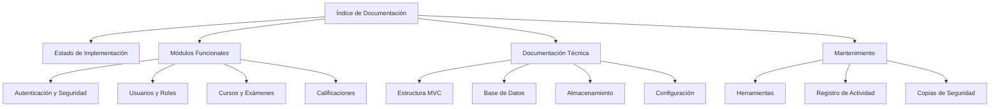

# Mapa Visual de la Documentación - AUTOEXAM2

**Última actualización:** 17 de junio de 2025

Este documento proporciona una representación visual de la estructura de documentación de AUTOEXAM2, permitiendo una navegación intuitiva por los diferentes módulos y componentes del sistema.

## 1. Organización General

```
documentacion/
├── actual/              # Documentación actualizada y unificada
│   ├── autenticacion/   # Sistema de autenticación y seguridad
│   ├── cursos/          # Gestión de cursos y exámenes
│   ├── sistema/         # Componentes centrales del sistema
│   ├── usuarios/        # Gestión de usuarios y perfiles
│   └── ...
├── historial/           # Documentación histórica
│   └── versiones/       # Documentos antiguos preservados
└── indice_documentacion.md  # Punto de entrada principal
```

## 2. Mapa de Relaciones entre Módulos



## 3. Navegación por Rol de Usuario

### 3.1. Para Desarrolladores

| Si necesitas información sobre... | Consulta este documento |
|----------------------------------|------------------------|
| Estructura general del proyecto | [Estructura del Proyecto](../01_estructura_presentacion/01_estructura_proyecto.md) |
| Estado actual de desarrollo | [Estado de Implementación](estado_implementacion.md) |
| Arquitectura MVC | [Arquitectura MVC y Ruteado](../01_estructura_presentacion/04_mvc_routing.md) |
| Base de datos | [Estructura de Base de Datos](../09_configuracion_mantenimiento/67_estructura_base_datos.md) |

### 3.2. Para Mantenimiento

| Si necesitas información sobre... | Consulta este documento |
|----------------------------------|------------------------|
| Gestión de configuración | [Sistema de Configuración](../01_estructura_presentacion/05_sistema_configuracion.md) |
| Almacenamiento de archivos | [Sistema de Almacenamiento](sistema/almacenamiento.md) |
| Copias de seguridad | [Backup y Restauración](../09_configuracion_mantenimiento/58_backup_restauracion.md) |
| Registro de errores | [Sistema de Manejo de Errores](../09_configuracion_mantenimiento/40_sistema_manejo_errores.md) |

### 3.3. Para Funcionalidades Específicas

| Si necesitas información sobre... | Consulta este documento |
|----------------------------------|------------------------|
| Login y autenticación | [Autenticación y Seguridad](autenticacion/autenticacion_seguridad.md) |
| Gestión de usuarios | [Módulo de Usuarios](../04_usuarios_dashboard/10_modulo_usuarios.md) |
| Fotos de perfil | [Gestión de Avatares](usuarios/gestion_avatares.md) |
| Cursos y exámenes | [Gestión de Cursos y Exámenes](cursos/gestion_cursos_examenes.md) |

## 4. Documentos Esenciales

Estos son los documentos fundamentales que proporcionan una visión general del sistema:

1. [Índice de Documentación](../indice_documentacion.md) - Punto de entrada principal
2. [Estado de Implementación](estado_implementacion.md) - Visión general del proyecto
3. [Estructura del Proyecto](../01_estructura_presentacion/01_estructura_proyecto.md) - Arquitectura técnica
4. [Sistema de Almacenamiento](sistema/almacenamiento.md) - Gestión de archivos
5. [Sistema de Revisiones](sistema_revisiones_documentacion.md) - Mantenimiento de documentación

## 5. Cómo Usar este Mapa

1. **Para comenzar**: Revisa el [Índice de Documentación](../indice_documentacion.md) y el [Estado de Implementación](estado_implementacion.md)
2. **Para módulos específicos**: Navega a la carpeta `/actual/` y selecciona el módulo correspondiente
3. **Para información histórica**: Consulta la carpeta `/historial/versiones/`

Este mapa se actualizará periódicamente como parte del [Sistema de Revisiones](sistema_revisiones_documentacion.md) para reflejar nuevos módulos y documentos.
