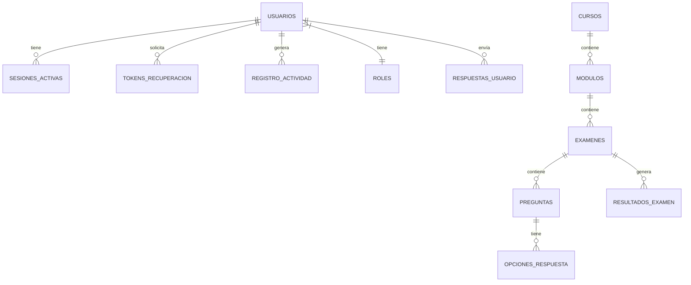

# Sistema de Base de Datos - AUTOEXAM2

**Última actualización:** 17 de junio de 2025  
**Versión:** 1.1

---

## Descripción General

El sistema de base de datos de AUTOEXAM2 implementa una estructura organizacional clara y eficiente para la gestión de scripts SQL, migraciones y datos iniciales. La organización sigue convenciones en español y está diseñada para facilitar tanto el desarrollo como el mantenimiento.

## Estructura `/base_datos/`

### Organización Principal
```
📂 base_datos/
├── 📁 migraciones/              # Scripts de esquema y actualizaciones
│   └── 001_esquema_completo.sql
├── 📁 mantenimiento/            # Scripts de limpieza y mantenimiento
│   ├── vaciar_todas_tablas.sql
│   └── eliminar_todas_tablas.sql
├── 📁 datos_iniciales/          # Datos básicos del sistema
│   └── admin_y_configuracion.sql (pendiente)
├── 📁 respaldos/                # Carpeta para copias de seguridad
└── README.md                    # Documentación de la estructura
```

## Componentes del Sistema

### 📁 **migraciones/**
Contiene los scripts que definen y actualizan el esquema de la base de datos:

- `001_esquema_completo.sql` - Script principal con las 19 tablas del sistema
- Scripts numerados secuencialmente para actualizaciones incrementales (002, 003...)

### 📁 **mantenimiento/**
Scripts para operaciones de mantenimiento y limpieza:

- `vaciar_todas_tablas.sql` - Limpia contenidos preservando la estructura
- `eliminar_todas_tablas.sql` - Elimina completamente todas las tablas

### 📁 **datos_iniciales/**
Scripts con datos necesarios para el funcionamiento básico:

- `admin_y_configuracion.sql` - Usuario administrador y configuración inicial (pendiente)

### 📁 **respaldos/**
Directorio para almacenar copias de seguridad de la base de datos, incluyendo:

- Backups automáticos generados por el sistema
- Copias manuales antes de actualizaciones importantes

## Tablas del Sistema (19 total)

### Autenticación y Usuarios
1. `usuarios` - Información principal de usuarios del sistema
2. `tokens_recuperacion` - Gestión de tokens para recuperación de contraseña
3. `intentos_login` - Registro de intentos de acceso para prevenir fuerza bruta
4. `sesiones_activas` - Control de sesiones de usuario activas

### Gestión Académica
5. `instituciones` - Centros educativos registrados
6. `cursos` - Cursos disponibles en la plataforma
7. `modulos` - Módulos organizados dentro de cada curso
8. `examenes` - Exámenes y evaluaciones del sistema
9. `preguntas` - Banco de preguntas para exámenes
10. `opciones_respuesta` - Opciones para preguntas de selección múltiple
11. `respuestas_usuario` - Respuestas enviadas por estudiantes
12. `resultados_examen` - Resultados finales de evaluaciones

### Sistema y Configuración
13. `configuracion_sistema` - Parámetros de configuración global
14. `registro_actividad` - Log detallado de actividades del sistema
15. `permisos` - Definición de permisos del sistema
16. `roles` - Roles disponibles en la plataforma
17. `usuario_roles` - Asignación de roles a usuarios
18. `config_versiones` - Control de versiones de configuración
19. `backups` - Registro de copias de seguridad realizadas

## Relaciones Principales



## Gestión de la Base de Datos

### Instalación Nueva
```bash
# 1. Crear esquema completo
mysql -u usuario -p base_datos < base_datos/migraciones/001_esquema_completo.sql

# 2. Insertar datos iniciales (cuando estén disponibles)
mysql -u usuario -p base_datos < base_datos/datos_iniciales/admin_y_configuracion.sql
```

### Mantenimiento
```bash
# Limpiar datos manteniendo estructura
mysql -u usuario -p base_datos < base_datos/mantenimiento/vaciar_todas_tablas.sql

# Crear respaldo
mysqldump -u usuario -p base_datos > base_datos/respaldos/backup_$(date +%Y%m%d_%H%M%S).sql
```

## Actualizaciones Recientes

### Junio 2025
- ✅ Se agregaron tablas `config_versiones` e `intentos_login` (protección fuerza bruta)
- ✅ Se refactorizaron claves foráneas para mejorar la integridad referencial
- ✅ Se mejoró el esquema de `registro_actividad` para seguimiento detallado
- ✅ Se unificó la estructura de tablas relacionadas con sesiones

## Buenas Prácticas

### Convenciones de Nomenclatura
- Tablas en plural y minúsculas (usuarios, cursos)
- Claves primarias como `id_[tabla_singular]` (id_usuario)
- Claves foráneas como `[tabla_referenciada_singular]_id`
- Índices con prefijo `idx_` seguido de campos

### Seguridad
- Contraseñas siempre almacenadas con hash seguro (no en texto plano)
- Campos sensibles con longitud adecuada (255 caracteres para hashes)
- Logs detallados de actividades para auditoría

### Optimización
- Índices en campos frecuentemente consultados
- Relaciones definidas con restricciones de integridad
- Tipos de datos apropiados para cada campo

## Tareas Pendientes

1. **Alta prioridad**
   - Crear script `admin_y_configuracion.sql` con datos iniciales
   - Completar documentación del archivo README.md en /base_datos

2. **Media prioridad**
   - Implementar script para verificación de integridad
   - Desarrollar mecanismo de migraciones incrementales

3. **Baja prioridad**
   - Optimizar scripts para grandes volúmenes de datos
   - Documentar procedimientos almacenados y triggers

---

**Referencias:**
- [Estado de Implementación](../estado_implementacion.md)
- [Sistema de Almacenamiento](almacenamiento.md)
- [Instalador del Sistema](../../01_estructura_presentacion/03_instalador.md)
